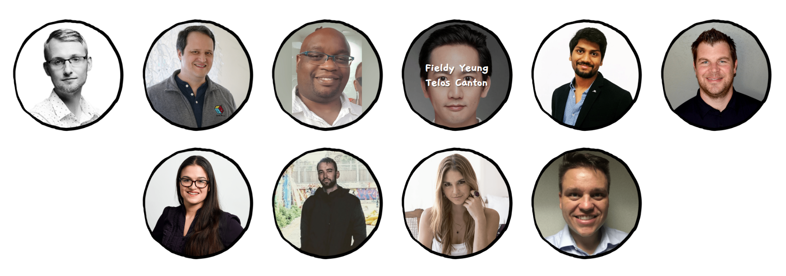

# Telos Canton Community Work

- Official Website: https://teloscanton.io
- [Code of Conduct](./CodeOfConduct.md)
- [Ownership Disclosure](./OwnershipDisclosure.md)

### 1. Partner of  Telos Foundation
https://telosfoundation.io/

### 1. Member of  Telos Launch Team (TLG)
Telos Canton is a member of TLG.

### 2. Initiator of  Telos Chinese Translation Team
Telos Canton plans to set up a Telos Chinese translation team to provide comprehensive Chinese material and information for Chinese users.   
The translation team is now in its infancy and is preparing to accelerate its operations.
Translation team intruduction: https://github.com/DAO-ECO/TelosDocs-En-Zh/blob/master/en-US/README_en-US.md

### 3. Member of  The GoodGrants Selection Committee
https://goodblock.io/goodgrant

------

### 1. Telos 基金会合作伙伴
https://telosfoundation.io/

### 2. 主网启动组成员
Telos Canon 是 Telos 主网启动组成员（ Telos Launch Team, 简称TLG）。

### 3. Telos中文翻译组发起人
Telos Canton 在早期便完整翻译了 Telos 白皮书的中文版，负责物识和对接专业翻译公司，完成 Telos 重要 BP 协议的中文版，并将对文档进行续字校对工作。
Telos Canton 计划成立 Telos中文翻译组，为 Telos 的华语圈用户提供全面的Telos中文资料和资讯。  
现在翻译组已有雏形，正准备加快运作。
翻译组介绍：https://github.com/DAO-ECO/TelosDocs-En-Zh/blob/master/README.md

### 4. DApp奖励计划选拨委员会成员
https://goodblock.io/goodgrant

